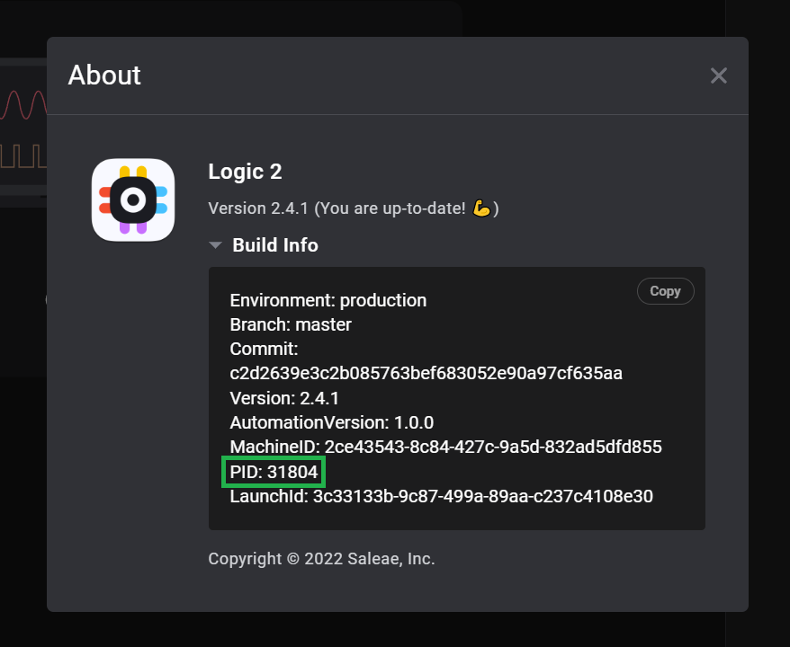

# Saleae Analyzer SDK Sample Analyzer

- [Saleae Analyzer SDK Sample Analyzer](#saleae-analyzer-sdk-sample-analyzer)
  - [Renaming your Analyzer](#renaming-your-analyzer)
  - [Cloud Building & Publishing](#cloud-building--publishing)
    - [Apple Silicon Support](#apple-silicon-support)
  - [Prerequisites](#prerequisites)
    - [Windows](#windows)
    - [MacOS](#macos)
    - [Linux](#linux)
  - [Building your Analyzer](#building-your-analyzer)
    - [Windows](#windows-1)
    - [MacOS](#macos-1)
    - [Linux](#linux-1)
  - [Debugging](#debugging)
    - [Windows](#windows-2)
    - [MacOS](#macos-2)
    - [Linux](#linux-2)
  - [Updating an Existing Analyzer to use CMake & GitHub Actions](#updating-an-existing-analyzer-to-use-cmake---github-actions)

The Saleae Analyzer SDK is used to create Low Level Analyzers (LLA) for the Saleae Logic software via a plugin architecture. These plugins are used to decode protocol data from captured waveforms. In many cases you can use a [High Level Analyzer Extension](https://support.saleae.com/extensions/high-level-analyzer-quickstart) to process data from an existing protocol decoder instead of building a LLA.

To build your own protocol decoder plugin, first fork, clone, or download this repository.

Then, make sure you have the required software installed for development. See the [Prerequisites](#Prerequisites) section below for details.

## Renaming your Analyzer

Once downloaded, first run the script rename_analyzer.py. This script is used to rename the sample analyzer automatically. Specifically, it changes the class names in the source code, it changes the text name that will be displayed once the custom analyzer has been loaded into the Saleae Logic software, and it updates the visual studio project.

There are two names you need to provide to rename_analyzer. The first is the class name. For instance, if you are developing a SPI analyzer, the class names would be SPIAnalyzer, SPIAnalyzerResults, SPIAnalyzerSettings, etc.
The file names would be similar, like SPIAnalyzer.cpp, etc.

All analyzer classes should end with "Analyzer," so the rename script will add that for you. In the first prompt after starting the script, enter "SPI". The analyzer suffix will be added for you. This needs to be a valid C++ class name - no spaces, it can't start with a number, etc.

Second, the script will prompt you for the display name. This will appear in the software in the list of analyzers after the plugin has loaded. This string can have spaces, since it will always be treated as a string, and not as the name of a class.

After that, the script will complete the renaming process and exit.

    python rename_analyzer.py
    SPI
    Mark's SPI Analyzer

Once renamed, you're ready to build your analyzer! See the [Building your Analyzer](#Building-your-Analyzer) section below.

API documentation can be found in [docs/Analyzer_API.md](docs/Analyzer_API.md).

## Cloud Building & Publishing

This example repository includes support for GitHub actions, which is a continuous integration service from GitHub. The file located at `.github\workflows\build.yml` contains the configuration.

When building in CI, the release version of the analyzer is built for Windows, Linux, and MacOS. The built analyzer files are available for every CI build. Additionally, GitHub releases are automatically created for any tagged commits, making it easy to share pre-built binaries with others once your analyzer is complete.

Learn how to tag a commit here: https://stackoverflow.com/questions/18216991/create-a-tag-in-a-github-repository

### Using downloaded analyzer binaries on MacOS

This section only applies to downloaded pre-built protocol analyzer binaries on MacOS. If you build the protocol analyzer locally, or acquire it in a different way, this section does not apply.

Any time you download a binary from the internet on a Mac, wether it be an application or a shared library, MacOS will flag that binary for "quarantine". MacOS then requires any quarantined binary to be signed and notarized through the MacOS developer program before it will allow that binary to be executed.

Because of this, when you download a pre-compiled protocol analyzer plugin from the internet and try to load it in the Saleae software, you will most likely see an error message like this:

> "libSimpleSerialAnalyzer.so" cannot be opened because th developer cannot be verified.

Signing and notarizing of open source software can be rare, because it requires an active paid subscription to the MacOS developer program, and the signing and notarization process frequently changes and becomes more restrictive, requiring frequent updates to the build process.

The quickest solution to this is to simply remove the quarantine flag added by MacOS using a simple command line tool.

Note - the purpose of code signing and notarization is to help end users be sure that the binary they downloaded did indeed come from the original publisher and hasn't been modified. Saleae does not create, control, or review 3rd party analyzer plugins available on the internet, and thus you must trust the original author and the website where you are downloading the plugin. (This applies to all software you've ever downloaded, essentially.)

To remove the quarantine flag on MacOS, you can simply open the terminal and navigate to the directory containing the downloaded shared library.

This will show what flags are present on the binary:

```sh
xattr libSimpleSerialAnalyzer.so
# example output:
# com.apple.macl
# com.apple.quarantine
```

This command will remove the quarantine flag:

```sh
xattr -r -d com.apple.quarantine libSimpleSerialAnalyzer.so
```

To verify the flag was removed, run the first command again and verify the quarantine flag is no longer present.

### Apple Silicon Support

Logic 2 now supports Apple Silicon natively!

The included Github Actions integration, documented [here](#cloud-building---publishing), will automatically build your analyzer for both x86_64 and arm64 architectures, for MacOS.

When you build your custom analyzer on a Mac, by default it will compile for the architecture of the system.

Unfortunately, universal binaries are not currently supported.

You can optionally cross build your analyzer using an x86_64 host system targeting arm64, or from a arm64 host system targeting x86_64.

To cross build, you will need to create a new build directory (for example `build/x86_64` or `build/arm64`). Then use the CMake variable [CMAKE_OSX_ARCHITECTURES](https://cmake.org/cmake/help/latest/variable/CMAKE_OSX_ARCHITECTURES.html).

Examples:

```bash
mkdir -p build/arm64
cd build/arm64
cmake -DCMAKE_OSX_ARCHITECTURES=arm64 ../..
cmake --build .
cd ../..
# built analyzer will be located at SampleAnalyzer/build/arm64/Analyzers/libSimpleSerialAnalyzer.so
mkdir -p build/x86_64
cd build/x86_64
cmake -DCMAKE_OSX_ARCHITECTURES=x86_64 ../..
cmake --build .
cd ../..
# built analyzer will be located at SampleAnalyzer/build/x86_64/Analyzers/libSimpleSerialAnalyzer.so
```

## Prerequisites

### Windows

Dependencies:

- Visual Studio 2017 (or newer) with C++
- CMake 3.13+
- git

**Visual Studio 2017**

_Note - newer versions of Visual Studio should be fine._

Setup options:

- Programming Languages > Visual C++ > select all sub-components.

Note - if CMake has any problems with the MSVC compiler, it's likely a component is missing.

**CMake**

Download and install the latest CMake release here.
https://cmake.org/download/

**git**

Git is required for CMake to automatically download the AnalyzerSDK, which is a dependency of this project. Git can be downloaded here: https://git-scm.com/

### MacOS

Dependencies:

- XCode with command line tools
- CMake 3.13+
- git

Installing command line tools after XCode is installed:

```
xcode-select --install
```

Then open XCode, open Preferences from the main menu, go to locations, and select the only option under 'Command line tools'.

Installing CMake on MacOS:

1. Download the binary distribution for MacOS, `cmake-*-Darwin-x86_64.dmg`
2. Install the usual way by dragging into applications.
3. Open a terminal and run the following:

```
/Applications/CMake.app/Contents/bin/cmake-gui --install
```

_Note: Errors may occur if older versions of CMake are installed._

### Linux

Dependencies:

- CMake 3.13+
- gcc 5+
- git

Misc dependencies:

```
sudo apt-get install build-essential
```

## Building your Analyzer

### Windows

```bat
mkdir build
cd build
cmake .. -A x64
cmake --build .
:: built analyzer will be located at SampleAnalyzer\build\Analyzers\Debug\SimpleSerialAnalyzer.dll
```

### MacOS

```bash
mkdir build
cd build
cmake ..
cmake --build .
# built analyzer will be located at SampleAnalyzer/build/Analyzers/libSimpleSerialAnalyzer.so
```

### Linux

```bash
mkdir build
cd build
cmake ..
cmake --build .
# built analyzer will be located at SampleAnalyzer/build/Analyzers/libSimpleSerialAnalyzer.so
```

## Debugging

Although the exact debugging process varies slightly from platform to platform, part of the process is the same for all platforms.

First, build your analyzer. Then, in the Logic 2 software, load your custom analyzer, and then restart the software. Instructions can be found here: https://support.saleae.com/faq/technical-faq/setting-up-developer-directory

Once restarted, the software should show your custom analyzer in the list of available analyzers.

Next, in order to attach your debugger, you will need to find the process ID of the Logic 2 software. To make this easy, we display the process ID of the correct process in the About dialog in the software, which you can open from the main menu. It's the last item in the "Build Info" box, labeled "PID". (Note, if you are using MacOS and you see "Architecture: x64 (Translated)" in the about dialog, this PID won't work. Contact support for details.)



You will need that PID number for the platform specific steps below.

Note, we strongly recommend only debugging your analyzer on existing captures, and not while making new recordings. The act of pausing the application with the debugger while recording data will cause the recording to fail once the application is resumed. To make development smooth, we recommend saving the capture you wish to debug with before starting the debugging process, so you can easily re-load it later.

### Windows

when `cmake .. -A x64` was run, a Visual Studio solution file was created automatically in the build directory. To debug your analyzer, first open that solution in visual studio.

Then, open the Debug menu, and select "attach to process...".

In the "Attach to:" selection box, ensure that "Native code" is selected. This is usually selected by default. If not, you will need to select it manually by clicking the "Select..." button to the right. After clicking "Select...", a new window will appear like shown below. Select "Native code" from there.


Afterwards, enter the PID number into the Filter box to find the correct instance of Logic.exe. Click attach.

Next, place a breakpoint somewhere in your analyzer source code. For example, the start of the WorkerThread function.

Make sure you already have recorded data in the application, and then add an instance of your analyzer. The debugger should pause at the breakpoint.

### MacOS

On MacOS, you can debug your custom analyzer using lldb.

However, before you can attach a debugger to the Logic 2 process on MacOS, you will need to add an additional [entitlement](https://developer.apple.com/documentation/bundleresources/entitlements) to the Logic 2 app packages.

This is because in order to distribute applications for MacOS, these applications must be [signed and notarized](https://developer.apple.com/documentation/security/notarizing_macos_software_before_distribution). One requirement for notarization is that debugging support is disabled.

If you attempt to attach a debugger to the Logic 2 process without adding an additional entitlement manually, you will see an error like this:

> error: attach failed: attach failed (Not allowed to attach to process. Look in the console messages (Console.app), near the debugserver entries, when the attach failed. The subsystem that denied the attach permission will likely have logged an informative message about why it was denied.)

Checking the output in Console.app, you will likely find logs like this:

> macOSTaskPolicy: (com.apple.debugserver) may not get the task control port of (Logic2 Helper (R) (pid: 95234): (Logic2 Helper (R) is hardened, (Logic2 Helper (R) doesn't have get-task-allow, (com.apple.debugserver) is a declared debugger(com.apple.debugserver) is not a declared read-only debugger

To fix this, you will need to add the [get-task-allow](https://developer.apple.com/documentation/bundleresources/entitlements/com_apple_security_cs_debugger) entitlement to all of the Logic 2 app packages.

You can use this 3rd party convenience script with the instructions below to add the entitlements. This process needs to be completed once per computer, and will need to be repeated after updating Logic 2.

[https://gist.github.com/talaviram/1f21e141a137744c89e81b58f73e23c3](https://gist.github.com/talaviram/1f21e141a137744c89e81b58f73e23c3)

Review and download that script, then add execution permissions from the terminal with `chmod +x add_debug_entitlement.sh`

Then run that script on the Logic 2 app directory, as well as the various included electron helper app packages:

```bash
./add_debug_entitlement.sh /Applications/Logic2.app
./add_debug_entitlement.sh /Applications/Logic2.app/Contents/Frameworks/Logic2\ Helper\ \(GPU\).app
./add_debug_entitlement.sh /Applications/Logic2.app/Contents/Frameworks/Logic2\ Helper.app
./add_debug_entitlement.sh /Applications/Logic2.app/Contents/Frameworks/Logic2\ Helper\ \(Plugin\).app
./add_debug_entitlement.sh /Applications/Logic2.app/Contents/Frameworks/Logic2\ Helper\ \(Renderer\).app
```

Now you're all set! To debug with command line lldb, simply launch the Logic 2 software and check the PID as explained above. Then run this from the terminal:

```bash
lldb
attach <pid>
```

Please see the Linux instructions below for more gdb command examples, which _mostly_ translate to lldb 1:1.

Once complete, you should also be able to attach other debugger GUIs like xcode or CLion to Logic 2 using the same PID.

### Linux

(Note, this section needs to be tested and updated if needed)

On Linux, you can debug your custom analyzer using GDB. This can be done from the console, however we recommend using a GUI tool like Visual Studio Code, with the C++ extension installed.

To debug from the command line, once you have loaded your analyzer into the logic software and have checked the process ID, you can attach gdb like so:

```bash
gdb
attach <pid>
```

If you see a permissions error like this, you will need to temporarily change the `ptrace_scope` setting on your system.

> Could not attach to process. [...] ptrace: Operation not permitted.

You can change the `ptrace_scope` like so, which will then allow you to attach to another process without sudo. (Be sure to `quit` gdb first)

```bash
sudo sysctl -w kernel.yama.ptrace_scope=0
```

You can learn more about `ptrace_scope` here: https://www.kernel.org/doc/Documentation/security/Yama.txt

Next, test setting a breakpoint like this. Be sure to use the correct class name.

```
break MyAnalyzer::WorkerThread
```

finally, attaching to the process will have paused the Logic application execution. Resume it with the continue command:

```bash
continue
```

If your analyzer hasn't been loaded yet, GDB will notify you that it can't find this function, and ask if you want to automatically set this breakpoint if a library with a matching function is loaded in the future. Type `y <enter>`

Then return to the application and add your analyzer. This should trigger the breakpoint.

To verify that symbols for your custom analyzer are loading, check the backtrace with the `bt` command. Example output:

```
#0  0x00007f2677dc42a8 in I4CAnalyzer::WorkerThread() ()
   from /home/build/Downloads/SampleAnalyzer-modernization-2022/build/Analyzers/libI4CAnalyzer.so
#1  0x00007f267046f24a in Analyzer::InitialWorkerThread() () from /tmp/.mount_Logic-0Fyxvr/resources/linux/libAnalyzer.so
#2  0x00007f267263bed9 in ?? () from /tmp/.mount_Logic-0Fyxvr/resources/linux/libgraph_server_shared.so
#3  0x00007f267264688e in ?? () from /tmp/.mount_Logic-0Fyxvr/resources/linux/libgraph_server_shared.so
#4  0x00007f26828e1609 in start_thread (arg=<optimized out>) at pthread_create.c:477
#5  0x00007f2681136293 in clone () at ../sysdeps/unix/sysv/linux/x86_64/clone.S:95
```

## Updating an Existing Analyzer to use CMake & GitHub Actions

If you maintain an existing C++ analyzer, or wish to fork and update someone else's analyzer, please follow these steps.

1. Delete the contents of the existing repository, except for the source directory, and the readme.
2. Copy the contents of this sample repository into the existing analyzer, except for the src and docs directories, or the rename_analyzer.py script. The `.clang-format` file is optional, it would allow you to auto-format your code to our style using [clang-format](https://clang.llvm.org/docs/ClangFormat.html).
3. Rename the existing source directory to src. This is optional, but it might make future updates from this sample analyzer easier to roll out. Make sure the CMakeLists.txt file reflects your source path.
4. In the new CMakeLists.txt file, make the following changes:

- In the line `project(SimpleSerialAnalyzer)`, replace `SimpleSerialAnalyzer` with the name of the existing analyzer, for example `project(I2CAnalyzer)`
- In the section `set(SOURCES`, replace all of the existing source code file names with the file names of the existing source code.

5. Update the readme! Feel free to just reference the SampleAnalyzer repository, or copy over the build instructions.
6. Try the build instructions to make sure the analyzer still builds, or commit this to GitHub to have GitHub actions build it for you!
7. Once you're ready to create a release, add a tag to your last commit to trigger GitHub to publish a release.
